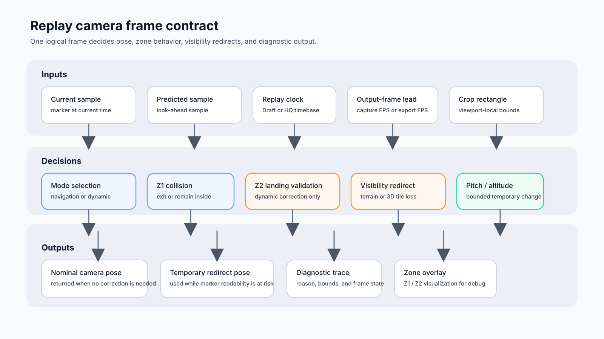
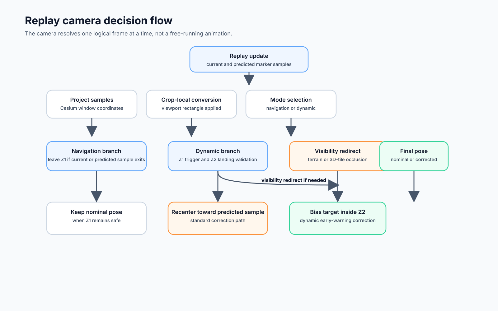
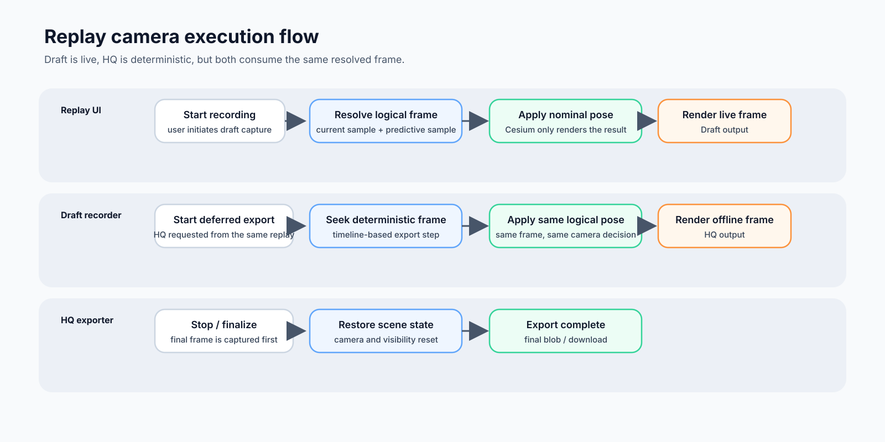
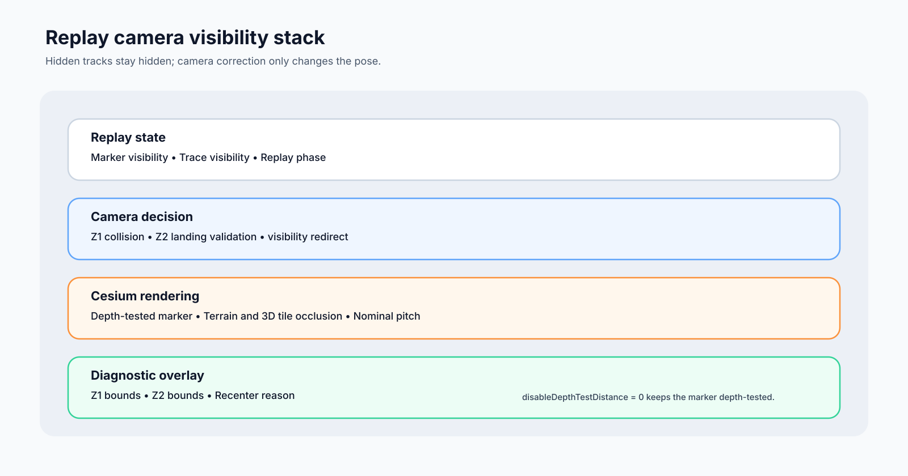
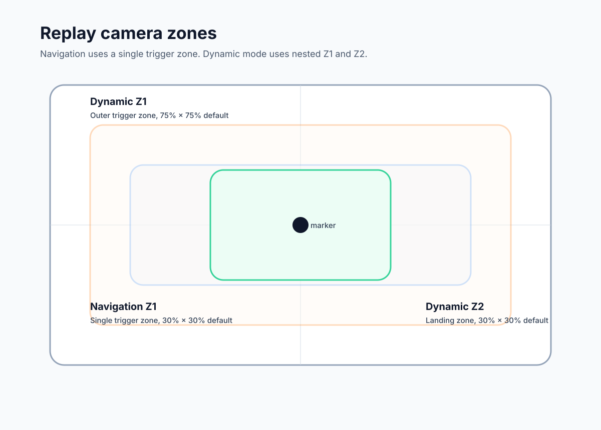
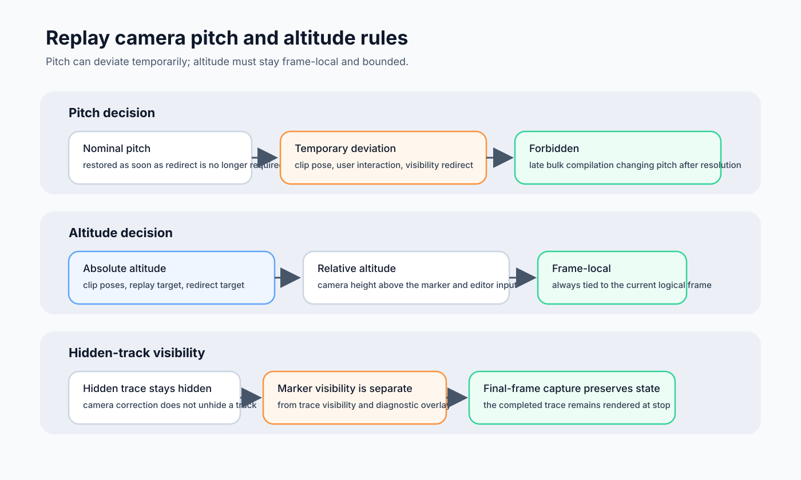

# Replay Camera Tracking Zones

This document describes the camera tracking zones used by replay video
recording and deferred HQ export.

## 1. Purpose

The replay camera follows a moving marker without continuously moving. It waits
until the marker reaches a defined trigger zone, then recenters the camera so
the marker remains comfortably visible.

The same camera-tracking rules are used by Draft recording and HQ export. HQ
does not use a different visual configuration: it evaluates the same algorithm
at deterministic export timestamps.

## 1.1. Related issue synthesis

The related issues describe one camera contract split across three concerns:

- path-space corrections: terrain altitude and speed-dependent roll;
- screen-space corrections: adaptive Z1/Z2 collision and visibility;
- timeline consistency: shared replay clip timing.

## 2. Decision schema

The camera is driven by one frame contract. The important part is not the UI
mode label, but the decision path used for each logical replay frame.

The figures below replace the text-only diagrams and keep the rules readable in
the rendered documentation.







### 2.1 Decision matrix

| Situation | Navigation | Dynamic | Result |
| --- | --- | --- | --- |
| Current marker stays inside Z1 | Keep nominal pose | Keep nominal pose | No correction |
| Current or predicted marker leaves Z1 | Recenter | Recenter | Standard correction |
| Marker is inside Z1 but outside Z2 | N/A | Bias target inside Z2 | Early-warning correction |
| Projection fails | Treat as outside | Treat as outside | Visibility-safe correction |
| Marker is hidden by terrain or tiles | Allow visibility redirect | Allow visibility redirect | Preserve readability |

### 2.2 Visibility and depth schema



The replay marker itself always remains depth-tested. Its Cesium point uses
`disableDepthTestDistance = 0`, so terrain relief and 3D tiles can mask it when
they are between the camera and the marker. Camera visibility correction must
not turn the marker into an overlay rendered above the relief.

## 2. Zone definitions

Coordinates are normalized to the viewport: `(0, 0)` is the top-left and
`(1, 1)` is the bottom-right. A centered zone of ratio `r` has:

```text
left   = (1 - r) / 2
top    = (1 - r) / 2
width  = r
height = r
```

The ratio applies independently to the viewport width and height. The zone is
not forced to be square in pixels. For example, a `30% × 30%` zone on a
`1080 × 1920` portrait crop is `324 × 576` pixels.

### Navigation mode

Navigation uses one zone only:

| Zone | Ratio | Normalized bounds | Meaning |
| --- | ---: | --- | --- |
| Z1 | 30% × 30% | `left=35%`, `top=35%`, `right=65%`, `bottom=65%` | Trigger zone for camera recentering |

There is no Z2 in navigation mode. When the marker leaves Z1, the camera aims
at the predicted marker position. On a narrow crop, Z1 uses `22% × 22%`; its
pixel dimensions therefore follow the crop aspect ratio instead of becoming a
square.

### Dynamic mode

Dynamic mode uses two nested concepts:

| Zone | Ratio | Normalized bounds | Meaning |
| --- | ---: | --- | --- |
| Z1 | 75% × 75% | `left=12.5%`, `top=12.5%`, `right=87.5%`, `bottom=87.5%` | Outer trigger zone |
| Z2 | 30% × 30% | `left=35%`, `top=35%`, `right=65%`, `bottom=65%` | Recenter landing zone |

Z1 is deliberately large: dynamic tracking starts early, before the marker
reaches the viewport edge. Z2 is the stable central area where the marker is
placed after a correction.



### Adaptive short-replay sizing

The dynamic zones are adapted from the logical replay duration, current
progress, camera transition duration, output-frame lead, and a calculation-lag
guard. The pressure is evaluated from the replay clock, not from Cesium wall
clock timing, so Draft and HQ can make the same decision for the same logical
frame.

The active zones are reduced smoothly when the replay is short or when the
remaining replay time is too small for a complete transition:

- dynamic Z1 remains the outer trigger zone and never goes below `30% × 30%`;
- dynamic Z2 remains the inner landing zone and never goes below `5% × 5%`;
- Z2 stays centered and strictly nested inside Z1;
- navigation keeps its single crop-aware Z1 and has no Z2 landing zone.

The `camera.update.step` trace entry named `tracking.zones.adaptive` exposes the
pressure, remaining time, transition budget, active zones, and the explicit Z1
and Z2 minimum ratios. A forced navigation correction is held for at least two
logical seconds in both Draft and HQ. HQ temporarily bypasses the shared
nominal path during that window, then returns to it when the correction is
released.

## 3. Trigger algorithm

For each replay update, the implementation projects the current and predicted
marker samples into Cesium window coordinates, then converts them into the
active video-crop coordinate space. This crop-local conversion is mandatory for
every video format, including landscape, square, and portrait 9:16 crops.

1. Project the marker into Cesium window coordinates.
2. Subtract the active crop's `left` and `top` offsets when a crop is active.
3. Convert the configured normalized zone into pixel bounds using the crop's
   width and height.
4. Treat a point on or beyond any bound as outside the zone.
5. In navigation mode, leave Z1 when the current or predicted point is outside
   the navigation zone.
6. In dynamic mode, use the same test against dynamic Z1. Z2 is not used as
   the initial trigger condition.
7. If a point cannot be projected, it is treated as outside the zone so that
   visibility is not silently lost.

The current and predicted samples are both checked because Cesium projection
can be updated asynchronously while Draft playback is running. Draft and HQ
use the same normalized Z1/Z2 definitions and collision decisions; only their
camera clocks differ.

The look-ahead also includes one output-frame interval. Draft resolves that
interval from `replay.captureFps`; HQ resolves it from the export timeline FPS.
Therefore a 15 FPS capture anticipates `66.67 ms`, while a 60 FPS capture
anticipates `16.67 ms`. This compensates for the larger position jump between
low-FPS frames without changing the visual size of Z1 or Z2.

## 4. Predictive processing

Predictive processing is used to compensate for camera movement, easing and
Cesium projection latency. It does not move the replay timeline forward. It
only selects a future path sample to decide whether the camera should start
moving and where it should aim.

### 4.1 Anchor and normal future sample

For every camera update, the nominal camera view first produces an `anchor`
sample: the marker position at the current replay time. The implementation then
computes a normal future sample:

```text
futureSample = sample at current distance + lookahead distance
predictedSample = futureSample or anchorSample
```

The look-ahead duration is the configured camera recenter duration. The path
sampler converts that duration to distance. To avoid an insignificant or zero
look-ahead, the selected distance is at least the greater of:

- the duration-derived distance;
- `120 m`;
- `1%` of the complete sampled path.

The sampler clamps the requested distance at the end of the path. If no later
sample exists, the current anchor is retained.

This normal future sample is used in both navigation and dynamic mode. In
navigation mode, leaving Z1 is tested with both the current and predicted
positions. The camera aims at the predicted position when a correction is
needed.

### 4.2 Extended dynamic look-ahead

Dynamic mode has a second, stronger prediction used only for a tight camera
angle near the crop boundary. It is enabled only when the current projected
marker is:

- inside dynamic Z1; and
- outside dynamic Z2.

This is the ring between Z1 and Z2. In that ring:

```text
extendedLookaheadSeconds = recenterDuration × 1.35
extendedTrackingSample  = sample at extended look-ahead distance
```

The `1.35` multiplier lets the camera lead the marker far enough for a closed
or steep pitch, where the marker can keep moving toward the crop edge while the
camera is still easing.

The multiplier is intentionally not applied in either of these cases:

- the marker is already inside Z2: use the normal `predictedSample`;
- the marker is already outside Z1: use the normal `predictedSample` and handle
  the active correction directly.

This makes the extended prediction an early-warning mechanism in the Z1–Z2
band, rather than a permanent acceleration of dynamic tracking.

### 4.3 Current and predicted screen positions

The current anchor and the selected tracking sample are projected into Cesium
window coordinates:

```text
currentScreen   = project(anchorSample)
predictedScreen = project(trackingSample)
```

The algorithm uses both positions because the current marker may still be
inside Z1 while its predicted position is already leaving it. This is also a
guard against asynchronous projection updates in live Draft playback.

If a screen position cannot be projected, it is treated as outside the relevant
zone. The camera therefore prefers a visibility correction over silently
allowing the marker to disappear.

### 4.4 Predictive collision and visibility checks

The current and selected future samples are tested against the camera's
configured trigger-zone collision model:

```text
currentCollision   = collision(anchorSample, Z1)
predictedCollision = collision(trackingSample, Z1)
outsideTolerance   = currentCollision.hard OR predictedCollision.hard
```

Dynamic mode separately tests the selected tracking sample against Z2. This
second test is not the initial trigger; it validates whether the promised
landing position was actually reached:

```text
outsideTargetZone = collision(trackingSample, Z2).hard
```

After the recenter duration has elapsed, an additional correction is allowed
if `outsideTargetZone` is still true. This catches cases where a steep camera
angle lets the marker continue toward the crop edge during the transition.

The future sample is used for Z1/Z2 positioning. Draft may also use it to
prepare a heading/position visibility redirect, but its pitch offset is removed
when the current nominal view is already visible. HQ uses the current marker
for visibility redirects. When the nominal current view is visible again, the
redirect is cleared and the nominal pitch is restored at the next camera
update.

### 4.5 Predictive Z2 target point

When a dynamic correction is required, the target point is selected inside Z2:

1. Compute the movement vector from the current screen point to the predicted
   screen point.
2. Reverse that vector so the camera moves against the marker's apparent
   screen movement.
3. Offset the center of Z2 by up to `35%` of Z2's width and height.
4. Clamp the result to Z2 bounds.
5. If there is no meaningful movement vector, use the center of Z2.

The offset is opposite to the marker's screen movement. For example, if the
marker is predicted to move right, the camera target is biased left within Z2.
This gives the marker room to continue moving after the camera correction and
avoids immediately triggering another correction.

The target point is used for the dynamic camera target calculation. When no
terrain/3D-tiles redirect is required, the camera flight itself uses the
tracking sample so that the geographic camera position remains synchronized
with the replay path. When a redirect is required for visibility, the redirect
view takes precedence.

## 5. Camera pitch, altitude, and hidden-track rules



If the replay layer hides a track or trace segment, the camera logic must not
override that visibility choice. Camera correction may change the pose to keep
the visible marker readable, but it does not promote a hidden track into a
visible one. The trace and marker remain governed by the replay visibility
contract, not by the camera correction path.

## 6. Camera recentering and hysteresis

The camera transition uses the configured replay easing and recenter duration.
The implementation keeps the last recenter progress and timestamp to avoid
replacing an active transition on every frame.

Dynamic mode also validates the Z2 landing after the nominal transition has
completed. If the marker is still outside Z2, a corrective recenter is allowed.
This is especially important for non-top-down camera pitches, where the marker
can continue moving toward a crop edge while the camera is easing.

Visibility correction is separate from ordinary tracking. If terrain or 3D
tiles hide the rendered marker, the camera may recenter for visibility when the
marker is outside the trigger conditions. Corrections inside Z1 are suppressed
unless visibility requires them.

The replay marker itself always remains depth-tested. Its Cesium point uses
`disableDepthTestDistance = 0`, so terrain relief and 3D tiles can mask it when
they are between the camera and the marker. Camera visibility correction must
not turn the marker into an overlay rendered above the relief.

## 7. Z1/Z2 diagnostic overlay

The replay mode draws a visual overlay for the configured tracking zones. This
overlay is intentionally useful beyond the current UI: it can be reused later
as a debugging surface for camera-tracking investigations. Adaptive logical
zone values are additionally exposed by the replay trace so the overlay does
not become a source of camera decisions.

The overlay has the following structure:

```text
.replay-tolerance-zone-overlay
└── .replay-tolerance-zone-overlay-outer [data-zone="z1"]
    └── .replay-tolerance-zone-overlay-inner [data-zone="z2"]
```

The outer element represents the displayed trigger zone. The inner element is
present only for dynamic mode and represents the target zone. The parent also
publishes the active mode through `data-mode`.

The overlay is positioned from normalized zone bounds and the current Cesium
surface rectangle, so it remains meaningful when the video crop or viewport
changes. It has `pointer-events: none`, which means it cannot interfere with
camera controls or replay interaction.

The overlay is visible by default during replay, Draft playback, and HQ preview
so the configured crop-local Z1/Z2 geometry can be inspected directly. The
adaptive active geometry is available in the `tracking.zones.adaptive` trace
entry. The overlay remains
non-interactive and is excluded from captured output through the existing
overlay/capture rules. It can be hidden at runtime with:

```js
globalThis.__?.ui?.replay?.setToleranceZoneOverlayVisible?.(false)
```

and shown again with the same method called with `true`.

For future debugging, the overlay can be extended with diagnostic attributes or
additional layers such as:

- the current marker screen position;
- the normal predicted position;
- the extended `1.35` look-ahead position;
- the current and predicted collision states;
- the selected Z2 target point;
- the reason for a recenter (`Z1 exit`, `Z2 correction`, or visibility loss).

Keeping the zone overlay separate from the camera algorithm allows these
diagnostic additions without changing replay behavior. Existing selectors and
`data-zone` attributes should remain stable so automated tests and debugging
tools can continue to identify Z1 and Z2.

## 8. Implementation references

- `src/core/ui/replay/JourneyReplayMode.js`: zone defaults, normalization,
  projection tests, target calculation, and camera tracking;
- `src/core/ui/replay/JourneyReplayPlaybackController.js`: live replay ticks
  and dynamic frame state;
- `src/core/ui/replay/ReplayDeferredExporter.js`: deterministic HQ frame
  publication;
- `src/__tests__/replay-phase1.test.js`: zone geometry and tracking behavior
  tests.
