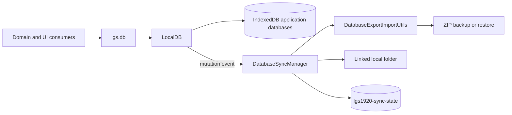

# Internal Database Architecture

This document describes the implemented LGS1920 Studio browser database, its JavaScript APIs, backup formats, and local persistent-folder synchronization.

The implementation is local-first. There is no database route in Elysia, no HTTP database API, and no IPC layer. Application data is stored in IndexedDB through `idb`; optional folder synchronization uses the browser File System Access API.

Related references:

- [LocalDB API reference](CORE-LOCALDB-API-REFERENCE.md)
- [Settings synchronization guide](SETTINGS_SYNC_GUIDE.md)
- [Future cloud synchronization work](../../todo/CLOUD-SYNC-TODO.md)

## Contents

1. [System Boundaries](#system-boundaries)
2. [Runtime Architecture](#runtime-architecture)
3. [Database And Store Catalog](#database-and-store-catalog)
4. [LocalDB Record Model](#localdb-record-model)
5. [JavaScript API](#javascript-api)
6. [Backup And Restore Format](#backup-and-restore-format)
7. [Persistent-Folder Synchronization](#persistent-folder-synchronization)
8. [Security And Recovery](#security-and-recovery)
9. [Known Implementation Constraints](#known-implementation-constraints)
10. [Change Workflow](#change-workflow)
11. [Tests And Source Map](#tests-and-source-map)

## System Boundaries

The database subsystem has four responsibilities:

- Persist application records in three environment-scoped IndexedDB databases.
- Expose CRUD, index lookup, TTL, diagnostics, and mutation notifications through `LocalDB`.
- Serialize the database collection to JSON files or ZIP archives.
- Mirror the complete collection to a user-selected local directory.

The following systems are separate:

- The PWA cache and Cesium cache do not store the application database records described here.
- Valtio owns live application state but is not the persistence engine.
- Cloud synchronization remains future work.
- The raw sync-state database stores synchronization infrastructure, not user-domain records.

## Runtime Architecture



### Startup Order

1. `AppUtils.init()` reads configuration and calls `lgs.createDB()`.
2. `LGS1920Context.createDB()` creates the three `LocalDB` instances and one `DatabaseSyncManager`.
3. `AppUtils.init()` hydrates settings and provider tokens from IndexedDB.
4. `LGS1920Context.initManagers()` calls `databaseSyncManager.bootstrap()`.
5. The bootstrap may replace IndexedDB with the linked-folder content.
6. Journey, widget, POI, and group hydration happens after the synchronization bootstrap.

This order is important. Journey and scene records imported from a linked folder are available before their runtime hydration. Settings and vault values are already hydrated before folder import, so externally changed settings or tokens may require another reload before the live application uses them.

The manager is exposed as:

- `lgs.databaseSyncManager`
- `__.ui.databaseSyncManager`

Application databases are exposed as:

- `lgs.db.lgs1920`
- `lgs.db.settings`
- `lgs.db.vault`

## Database And Store Catalog

The platform suffix is empty in production and `-${platform}` in other environments.

| Logical scope | IndexedDB name | Version | Stores |
|---|---|---:|---|
| `lgs1920` | `LGS1920[-platform]` | 22 | `journeys`, `journey-groups`, `current`, `origin`, `pois`, `widgets` |
| `settings` | `settings-LGS1920[-platform]` | 1 | `settings` |
| `vault` | `vault-LGS1920[-platform]` | 1 | `vault` |
| Sync infrastructure | `lgs1920-sync-state` | 1 | `state` |

The sync-state database is not platform-suffixed. Development, staging, test, and production contexts in the same browser profile can therefore address the same persisted folder handle and sync metadata.

Application stores use out-of-line string keys and no auto-increment. The only declared application index is:

```text
database: LGS1920[-platform]
store: widgets
index: group
keyPath: data.group
unique: false
```

The `data.` prefix is required because `LocalDB` wraps every payload.

### Functional Store Schema

| Store | Key | Payload and owner |
|---|---|---|
| `journeys` | Journey slug | Serialized `Journey` from `Journey.unproxify`; normalized by `Journey.deserialize` |
| `journey-groups` | Group ID | Group metadata, hierarchy, journey references, and timestamps owned by `JourneyGroupManager` |
| `current` | Fixed keys such as `journey`, `track`, `camera`, and `poi` | Current selection and camera recovery records; current-track representations are not fully normalized |
| `origin` | Journey slug | Original GeoJSON stored as a JSON string |
| `pois` | POI ID | Serialized `MapPOI`; temporary or untyped POIs are not persisted |
| `widgets` | Widget instance ID | Position and configuration data, optional record TTL, and the indexed `group` field |
| `settings` | Root settings section | JSON-cloned section merged with YAML defaults by `SettingsSection` |
| `vault` | Token name or provider layer ID | Cesium Ion and provider credentials stored as unencrypted values |
| `state` | Fixed sync keys | Raw directory handle, client ID, manifest signature, and last sync status |

The sync-state keys are:

```text
database-sync.directory-handle
database-sync.client-id
database-sync.manifest-signature
database-sync.status
```

## LocalDB Record Model

`LocalDB.put(key, value, store, ttl)` stores an out-of-line key and this envelope:

```javascript
{
    data: value,
    _ct_: Date.now(),
    _mt_: Date.now(),
    _ttl_: ttlInMilliseconds,
    _exp_: expirationTimestamp
}
```

`_ttl_` and `_exp_` are present only when the supplied TTL is positive. The public TTL argument is expressed in seconds. Every `put` recreates both `_ct_` and `_mt_`; `_ct_` is therefore a write timestamp, not an immutable creation timestamp.

`get(key, store)` returns `envelope.data`. `get(key, store, true)` returns the envelope. Expired records are removed lazily when read by key and are omitted from index results.

### Cache And Transactions

- The in-memory cache lifetime is 60 seconds.
- The cache accepts at most 1,000 entries.
- Transactions are attempted up to three times.
- Retry delay increases by 10 milliseconds per attempt.
- `put`, effective `delete`, and `clear` emit mutation events after a successful transaction.
- There is no public multi-store or multi-database transaction API.

Mutation listeners receive:

```javascript
{
    database,
    timestamp,
    action: 'put' | 'delete' | 'clear',
    store,
    key,
    value
}
```

`key` and `value` are present only when relevant to the action.

## JavaScript API

### LocalDB

| Member | Contract |
|---|---|
| `dbName` | Return the physical IndexedDB name |
| `storeNames` | Return a copy of configured store names |
| `transientStore` | Return `transients` when enabled, otherwise `null` |
| `get(key, store, full = false)` | Return payload, full envelope, or `null` |
| `put(key, value, store, ttl = null)` | Write a payload; TTL is in seconds |
| `delete(key, store)` | Return whether an existing record was deleted |
| `clear(store)` | Remove all records from one store |
| `keys(store)` | Return all IndexedDB keys from one store |
| `hasKey(key, store)` | Return `false` for a missing key or any read error |
| `findByIndex(indexName, indexValue, store, full = false)` | Return matching payloads or envelopes |
| `subscribeMutations(listener)` | Subscribe and return an unsubscribe function |
| `forceOneTimeRebuild(store)` | Rewrite a store to repopulate indexes |
| `deleteDB()` | Return `1` for success, `0` for error, or `2` when blocked |
| `diagnose()` | Return database/store/cache diagnostics or `{error}` |
| `clearMemoryCache()` | Remove cached reads |

Use `put` in application code. Although `set` and `update` are declared as aliases, their current class-field initialization happens before `put` and leaves both aliases undefined.

Keys must be non-empty strings and stores must have been declared at construction. `hasKey`, `diagnose`, and `deleteDB` convert some failures into values instead of throwing; callers must handle those contracts explicitly.

### Export And Import Utilities

`src/core/db/DatabaseExportImportUtils.js` exports:

| Function | Purpose |
|---|---|
| `exportStoreToJson` | Serialize one store |
| `importJsonToStore` | Parse and import one store payload |
| `importRecordsToStore` | Clear optionally, then write records sequentially |
| `exportLocalDBToFiles` | Serialize one `LocalDB` to a file map |
| `exportLocalDBToZip` | Serialize one `LocalDB` to ZIP bytes |
| `importLocalDBFromZip` | Restore one `LocalDB` from ZIP input |
| `exportDatabaseBundleToFiles` | Serialize an object, `Map`, or array of databases |
| `exportDatabaseBundleToZip` | Serialize the database collection to ZIP bytes |
| `importDatabaseBundleFromZip` | Restore the database collection from ZIP input |

Archive input can be a `Blob`, `Uint8Array`, `ArrayBuffer`, or an object exposing `arrayBuffer()`.

Accepted store JSON shapes include:

- A raw record array
- A single `{key, value}` object
- `{records: [...]}` or `{entries: [...]}`
- `{data: {key: value}}`

Records without a string key are skipped. Import is sequential and not transactional.

### DatabaseSyncManager

| Member | Contract |
|---|---|
| `setDatabases(databases)` | Replace the managed database collection |
| `syncState` | Return the current observable state snapshot |
| `startupWarning` | Return the warning derived from the last bootstrap |
| `directoryHandle` | Return the active directory handle or `null` |
| `hasPersistentDirectory` | Report whether a handle is active |
| `subscribeSyncStatus(listener)` | Invoke immediately, subscribe, and return an unsubscribe function |
| `supportsPersistentDirectory()` | Test for `window.showDirectoryPicker` |
| `bootstrap()` | Restore state and linked folder once per manager instance |
| `linkPersistentDirectory()` | Pick, persist, import, and align a folder |
| `unlinkPersistentDirectory()` | Remove the handle and manifest signature |
| `exportZipBackup()` | Return ZIP bytes |
| `importZipBackup(...)` | Restore a ZIP into the managed collection |
| `downloadZipBackup(...)` | Trigger a browser ZIP download |
| `processZipUpload(...)` | Validate a selected file and restore it |
| `flushToPersistentDirectory(...)` | Return `true` on sync, otherwise `false`; ordinary write failures also throw |
| `overwritePersistentDirectory()` | Force a folder rewrite and bypass conflict detection |

`bootstrap()` currently resolves without a boolean despite its source JSDoc. `flushToPersistentDirectory()` currently returns a boolean despite source JSDoc that says `Promise<void>`.

### Synchronization State

```javascript
{
    directoryName,
    hasPersistentDirectory,
    lastSyncedAt,
    message,
    status,
    supportsPersistentSync,
    synchronized,
    synchronizationRequired,
    updatedAt
}
```

| Status | Meaning |
|---|---|
| `idle` | No active folder or only manual backup is supported |
| `pending` | A visible link or flush operation is running |
| `synced` | The last completed folder write succeeded |
| `permission-denied` | Read/write permission is unavailable |
| `conflict` | A newer manifest from another client was detected before a flush |
| `error` | Export, cleanup, or folder write failed |

`synchronized` is true only for `synced`. `synchronizationRequired` is true for `pending`, `permission-denied`, `conflict`, and `error`.

A local mutation waiting for its two-second debounce does not change the state to `pending`.

## Backup And Restore Format

The scope names, not the physical IndexedDB names, define the exported paths:

```text
lgs1920/
  journeys/<slug>.json
  journey-groups.json
  current.json
  origin.json
  pois.json
  widgets.json
settings/
  settings.json
vault/
  vault.json
```

Folder synchronization adds:

```text
.lgs-sync/
  manifest.json
```

Each journey has a dedicated file. Every other store is represented by one file:

```json
{
  "store": "widgets",
  "exportedAt": "2026-07-23T00:00:00.000Z",
  "count": 1,
  "records": [
    {
      "key": "widget-id",
      "value": {},
      "meta": {
        "createdAt": null,
        "modifiedAt": null,
        "ttlMillis": null,
        "expiresAt": null
      }
    }
  ]
}
```

Import does not restore `_ct_` or `_mt_`. `LocalDB.put` assigns new timestamps. A positive exported TTL is converted back to seconds and starts a new duration.

### Restore Semantics

| Workflow | Clear behavior | Reload behavior |
|---|---|---|
| Manual ZIP import | Clear only stores represented by files in the archive | UI reloads after 250 milliseconds |
| Linked-folder bootstrap | Clear every store in all three application databases before reading files | No automatic reload after bootstrap |
| Explicit folder link | Clear every store before import | UI reloads after successful link |

An archive with no `journeys/*.json` file does not clear an existing `journeys` store. A linked folder with no journey files does clear it because all stores are cleared before folder import.

## Persistent-Folder Synchronization

Folder synchronization is a full local mirror, not a record-level synchronization engine.

### Link And Bootstrap

The same source-of-truth rule applies at startup and during an explicit link:

1. Obtain and persist the directory handle.
2. Request read/write permission.
3. Suspend mutation-triggered flush scheduling.
4. Clear every store in `lgs1920`, `settings`, and `vault`.
5. Import JSON files found below the scope roots.
6. Export the resulting IndexedDB collection back to the folder.
7. Write a new manifest and mark the state as synchronized.

The folder always wins at this stage. An empty or incomplete folder can erase local IndexedDB records. Linking is not an export-to-folder operation.

### Mutation Flow

After bootstrap, `DatabaseSyncManager` subscribes to each `LocalDB`:

1. A successful `put`, `delete`, or `clear` emits a mutation.
2. The manager coalesces mutations with a two-second timer.
3. The timer exports all three databases, not only the changed record.
4. The manager checks the linked manifest for a conflict.
5. Managed stale JSON files are removed.
6. Current files and the manifest are written sequentially.

No timer is scheduled while the state is `conflict`, `error`, or `permission-denied`. Recovery requires a manual retry, overwrite, or permission action.

There is no persistent queue, unload flush, retry backoff, write mutex, multi-file transaction, or record-level merge.

### Manifest And Conflict Detection

`.lgs-sync/manifest.json` contains:

```json
{
  "clientId": "stable-browser-profile-id",
  "files": {
    "lgs1920/widgets.json": {
      "checksum": "f4a12345",
      "size": 1234
    }
  },
  "version": 1,
  "writtenAt": "2026-07-23T00:00:00.000Z"
}
```

The checksum is a non-cryptographic 32-bit FNV-1a hash. It is used to compare manifests and is not used to validate file content during import.

A normal flush reports a conflict only when all of these conditions hold:

- The linked manifest belongs to another client.
- A previous manifest signature exists locally.
- The linked `writtenAt` is valid and newer than `syncState.lastSyncedAt`.
- The linked signature differs from both the previous signature and the next local export.

Same-client, legacy, or older manifests do not block a flush. Startup and explicit linking import the folder first and then use a forced flush, so conflict detection protects only later in-session writes.

`overwritePersistentDirectory()` is the current conflict resolution path. It discards the external version by forcing the current IndexedDB state into the folder.

### Managed File Cleanup

Cleanup is intentionally scoped:

- Unexpected JSON files below currently managed scope roots can be removed.
- The internal `.lgs-sync` root is not traversed for stale-file deletion.
- Unrelated files at the selected folder root are preserved.
- Non-JSON files are preserved.

Writes and deletions are sequential. An interrupted operation can leave a partially updated folder.

## Security And Recovery

The `vault` name does not imply encryption. Manual ZIP backups and linked folders include `vault/vault.json` in clear JSON. Treat both outputs as credentials:

- Do not commit them.
- Do not place them in a publicly shared folder.
- Do not attach them to bug reports without redaction.
- Rotate provider tokens after accidental disclosure.

Before linking a folder, create a manual backup and verify the ZIP can be opened. Use a folder whose contents are intentionally authoritative.

`ResetProfile` unlinks the folder before deleting the three application databases. `RemoveProfile` deletes the three databases but does not currently remove the separate sync-state database or its persisted handle.

## Known Implementation Constraints

These points describe current behavior, not desired guarantees:

- `LocalDB.set` and `LocalDB.update` are undefined because their class fields are initialized before `put`.
- Key reads can remain cached for up to 60 seconds, including across the exact expiry moment of a short record TTL.
- Cached `findByIndex` results are not invalidated by `put` or `delete`, so index reads can remain stale for up to 60 seconds.
- Repairing a missing index rewrites the store but cannot create the index without an IndexedDB version upgrade; repeated `findByIndex` repair can recurse indefinitely.
- Some widget TTL consumers use millisecond-derived constants even though `LocalDB.put` expects seconds.
- ZIP and folder imports are not atomic and have no rollback.
- A local write followed by tab close or reload before the two-second flush can be lost when the folder wins at the next bootstrap.
- Restoring a ZIP while a folder is linked schedules a delayed folder flush, but the UI reloads before that timer. The linked folder can therefore overwrite the restored ZIP at startup.
- Two tabs in the same browser profile share the sync client ID and are not protected as independent writers.
- Direct edits to synchronized JSON files are detected only when a later manifest-aware flush runs, and only if the manifest also changed.
- Sync-state is shared across platform-suffixed application databases.
- Settings and vault imported during bootstrap are not rehydrated into already-created runtime objects.
- There are no direct tests of `LocalDB` against a real or fake IndexedDB implementation.

## Change Workflow

### Add A Store

1. Add or reuse a constant in `src/core/constants.js`.
2. Add the store to the appropriate `LocalDB` configuration.
3. Increment that database version.
4. Define the owning serializer, deserializer, default, and reset behavior.
5. Verify automatic JSON/ZIP and folder export paths.
6. Test upgrade, empty data, round trip, and legacy startup.

### Add Or Change An Index

1. Point the index at the stored envelope, normally `data.<field>`.
2. Increment the database version.
3. Verify the upgrade callback creates or replaces the index.
4. Test records created before the upgrade and immediate reads after mutations.

### Change A Payload

1. Update the owner that serializes the record.
2. Normalize legacy values on read without requiring a global destructive migration.
3. Check Valtio proxy removal and structured-clone compatibility.
4. Check JSON serialization and archive backward compatibility.
5. Add domain and round-trip tests.

### Change Synchronization

1. Preserve the explicit source-of-truth decision.
2. Test empty, incomplete, corrupt, legacy, and externally modified folders.
3. Test permission denial, stale handles, interrupted writes, and multiple clients.
4. Keep forced overwrite behind explicit confirmation.
5. Update this document and the user-facing sync guide together.

## Tests And Source Map

Focused tests:

```bash
bunx --bun vitest run \
  src/__tests__/unit/data/database-export-import-utils.test.js \
  src/__tests__/unit/data/database-sync-manager.test.js
```

Current direct coverage includes JSON and ZIP journey round trips, stale-file cleanup, root-file preservation, permissions, stale handles, folder-first import, manifest compatibility, debounced status behavior, and external-client conflicts.

Important gaps include direct `LocalDB` behavior, cache and TTL boundaries, version upgrades, partial import recovery, empty backups, linked-folder ZIP restore, multi-tab writes, unload-before-flush, and runtime settings/vault rehydration.

| Concern | Primary source |
|---|---|
| Database definitions and bootstrap wiring | `src/core/LGS1920Context.js` |
| Store constants | `src/core/constants.js` |
| IndexedDB wrapper | `src/core/db/LocalDB.js` |
| JSON and ZIP formats | `src/core/db/DatabaseExportImportUtils.js` |
| Folder sync and state | `src/core/db/DatabaseSyncManager.js` |
| Startup settings and token hydration | `src/Utils/AppUtils.js` |
| Sync UI | `src/components/Settings/application/profile/SyncMyProfile.jsx` |
| Manual backup UI | `src/components/Settings/LocalDbSettings.jsx` |
| Reset behavior | `src/components/Settings/application/profile/ResetProfile.jsx` |
| Export/import tests | `src/__tests__/unit/data/database-export-import-utils.test.js` |
| Folder sync tests | `src/__tests__/unit/data/database-sync-manager.test.js` |
