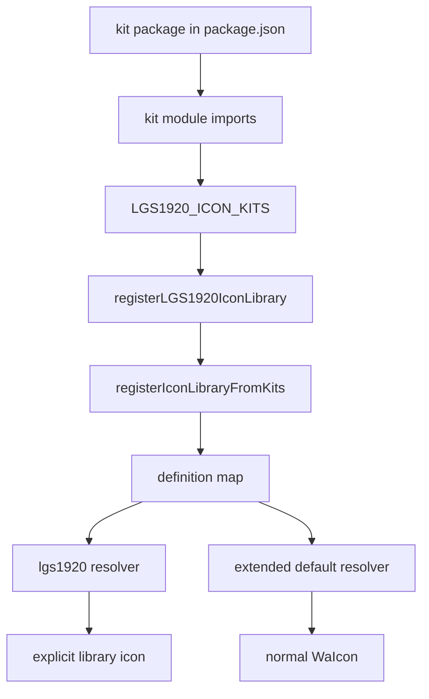

# Web Awesome Icon System

## Status

This document describes the implemented icon integration used by the application. It is the
reference for selecting, registering, extending, and testing Web Awesome and Font Awesome
icons.

## Purpose

The application uses Web Awesome's `wa-icon` component as the UI icon surface and Font Awesome
as the icon definition and SVG rendering source. The integration supports custom Font Awesome
kits while preserving Web Awesome's normal icon library behavior.

The integration provides these properties:

- Components use the native `WaIcon` React wrapper without a project-specific icon wrapper.
- Public names use Font Awesome icon names in kebab case.
- `family` and `variant` select the relevant custom kit definition.
- The `classic` family remains the default and does not need to be specified.
- Custom kit imports are centralized and are not repeated in UI components.
- Icons absent from the custom kits continue through Web Awesome's default resolver.

## Public component contract

Use the Web Awesome React wrapper in React components:

```jsx
<WaIcon name="camera-sliders" />
```

The equivalent custom element syntax is:

```html
<wa-icon name="camera-sliders"></wa-icon>
```

The public `name` is the Font Awesome definition's `iconName`, normalized to the name used by
the component. JavaScript export names are implementation details and are not public names.
For example, the kit export `faCameraSliders` is used with `name="camera-sliders"`.

The default `classic` family is implicit:

```jsx
<WaIcon name="camera-sliders" variant="solid" />
```

Specify `family` when selecting another family:

```jsx
<WaIcon name="cave-in-mountains" family="duotone" variant="regular" />
<WaIcon name="github" family="brands" />
<WaIcon name="video" family="sharp" variant="solid" />
```

`family` and `variant` are icon properties. They are independent from a button's appearance or
variant.

The `library` property is optional for custom kit icons because the integration extends the Web
Awesome `default` library. It can be provided when the custom library must be selected explicitly,
including icons rendered in a separate browser document such as a Picture-in-Picture window:

```jsx
<WaIcon
    library="my-library"
    name="camera-sliders"
    variant="solid"
/>
```

## Font Awesome definitions and prefixes

Font Awesome definitions contain a prefix that identifies their internal icon namespace. The
prefix is required by Font Awesome's renderer and remains in the definition:

| Definition prefix | Web Awesome family | Meaning |
| --- | --- | --- |
| `fak` | `classic` | Custom icon from a classic kit |
| `fakd` | `duotone` | Custom icon from a duotone kit |
| `fab` | `brands` | Font Awesome brand definition |
| `fas`, `far`, and related prefixes | `classic` or another Font Awesome family | Font Awesome style definition |

The prefix is not included in the `name` prop. Web Awesome `family` and `variant` values are
the component-level selection API. The resolver maps those values to the appropriate definition
and Font Awesome then uses the definition prefix while generating the SVG.

## Registration architecture

The generic resolver is implemented in [`src/Utils/useWebAwesomeKits.js`](../../../src/Utils/useWebAwesomeKits.js). The
application bootstrap imports the concrete kit modules and passes them to the resolver.

The application imports the custom kit modules once, at the application bootstrap boundary:

```js
import * as kitIcons from '@awesome.me/kit-########/icons/kit/custom'
import * as kitDuotoneIcons from '@awesome.me/kit-########/icons/kit-duotone/custom'
```

The default ordered registrations associate each module with a Web Awesome family:

```js
const MY_LIBRARY_KITS = [
    {family: 'classic', icons: kitIcons},
    {family: 'duotone', icons: kitDuotoneIcons},
]

registerIconLibraryFromKits('my-library', MY_LIBRARY_KITS)
```

`registerIconLibraryFromKits(libraryName, kits)` performs two registrations during application
initialization:

1. It registers the supplied `libraryName` for explicit selection.
2. It replaces the Web Awesome `default` resolver with a resolver that checks the custom kit
   definitions first and delegates missing icons to the original resolver.

The existing default library mutator and sprite sheet are preserved when the default resolver
is replaced. This keeps Web Awesome's existing behavior available for icons outside the custom
kits.

## Definition indexing

The ordered kit list is converted into a map keyed by family, variant, and public name:

```text
family:variant:name
```

The resolver applies this sequence:

1. Read the `name`, `family`, and `variant` values received from Web Awesome.
2. Use `classic` and `solid` as internal defaults when Web Awesome does not provide a value.
3. Search for an exact family, variant, and name match.
4. Search for a family and name match with a wildcard variant for definitions without a specific
   variant.
5. Render the matching Font Awesome definition through `@fortawesome/fontawesome-svg-core`.
6. Delegate to Web Awesome's original default resolver when no custom definition matches.

Some generated custom kit exports encode a style in the internal icon name, for example
`regular-cave-in-mountains` or `solid-circle-slash`. The registry removes that style prefix
from the public lookup name and stores it as the variant. This allows the component contract to
remain `name="cave-in-mountains"` with `variant="regular"`.

Definitions without an encoded style, such as `camera-sliders` and the custom duotone exports,
use a wildcard variant. They can be selected with the requested variant while their family still
controls which kit is searched.

## Kit ordering and extension

`registerIconLibraryFromKits(libraryName, kits)` accepts a library name and an ordered array of
kit registrations. The first matching definition for an identical family, variant, and public
name is retained.

```js
registerIconLibraryFromKits('my-library', [
    {family: 'classic', variant: 'regular', icons: classicRegularIcons},
    {family: 'classic', variant: 'solid', icons: classicSolidIcons},
    {family: 'duotone', icons: duotoneIcons},
])
```

Each registration should identify the Web Awesome `family` and may provide a `variant` when all
definitions in that module share one style. When the registration does not provide a variant,
the resolver derives `thin`, `light`, `regular`, or `solid` from the generated icon name when
present. The definition prefix provides the family fallback for supported Font Awesome prefixes.

New kit modules must be imported by the application bootstrap and passed to
`registerIconLibraryFromKits()`. A UI component should only consume the Web Awesome icon
component and its public name, family, and variant properties.

### Separate browser documents

A popup or Document Picture-in-Picture window owns a separate `Window` and `Document`. Its
`customElements` registry and Web Awesome icon-library registry are also separate from the main
application document. Rendering a React portal into that document moves the DOM nodes, but it does
not copy the Web Awesome element definition or the registered icon libraries.

The external-window bootstrap must therefore load the `wa-icon` definition and register the custom
kit in the external browser context. Components rendered there must select the named custom library
explicitly when they use a kit icon:

```jsx
<WaIcon library="my-library" name="picture-in-picture-out" variant="regular" />
```

If the external context has not registered the kit, the custom definition cannot be resolved and
`wa-icon` can remain on its initial empty 16-by-16 SVG placeholder. The bootstrap registers the
library in that context, while the explicit `library` property removes ambiguity when the icon is
rendered in the detached window.

## Accessibility

An icon that conveys meaning by itself must provide an accessible label through Web Awesome's
`label` property or an equivalent surrounding accessible name. Decorative icons inside a labelled
control should use the existing control label and remain hidden from redundant assistive output
according to the Web Awesome component behavior.

Icon-only controls must retain a visible or programmatic accessible name and a tooltip when the
surrounding UI pattern requires one. The icon registry does not provide accessible text and must
not be used as a replacement for control semantics.

## Failure behavior

The named custom resolver throws an error when an explicitly requested custom icon is not
available in the registered kits or cannot be rendered. The extended `default` resolver uses
Web Awesome's original behavior for missing custom names, which allows standard Web Awesome and
Font Awesome icons to continue working.

The following names are invalid for the public component contract:

```jsx
<WaIcon name="faCameraSliders" />
<WaIcon name="fak-camera-sliders" />
```

Use `name="camera-sliders"` instead.

## Validation

The integration is covered by:

- [`src/__tests__/unit/utils/use-web-awesome-kits.test.js`](../../../src/__tests__/unit/utils/use-web-awesome-kits.test.js),
  which tests classic, duotone, family and variant selection, kit ordering, default fallback,
  and rejection of JavaScript export names.
- [`src/__tests__/ui/replay/replay-drawer.test.jsx`](../../../src/__tests__/ui/replay/replay-drawer.test.jsx),
  which verifies the application uses the public `camera-sliders` name through `WaIcon`.
- [`src/__tests__/unit/data/app-utils-count.test.js`](../../../src/__tests__/unit/data/app-utils-count.test.js),
  which verifies centralized registration during application initialization.

Run the focused tests with:

```bash
bunx --bun vitest run \
    src/__tests__/unit/utils/use-web-awesome-kits.test.js \
    src/__tests__/ui/replay/replay-drawer.test.jsx \
    src/__tests__/unit/data/app-utils-count.test.js
```

The implementation uses Web Awesome Pro `3.14.0`. Consult the [Web Awesome icon
documentation](https://webawesome.com/docs/components/icon) when the library or wrapper API
changes.

## Complete implementation guide

This section describes the complete path from the kit package to a rendered icon and provides
copyable examples for the common integration cases.

### Source map

| Responsibility | Source |
| --- | --- |
| Kit module imports and family mapping | [LGS1920IconLibrary.js](../../../src/Utils/LGS1920IconLibrary.js#L17-L32) |
| Application library name | [useWebAwesomeKits.js](../../../src/Utils/useWebAwesomeKits.js#L23) |
| Definition registry | [buildIconDefinitions](../../../src/Utils/useWebAwesomeKits.js#L37-L68) |
| Definition lookup | [findIconDefinition](../../../src/Utils/useWebAwesomeKits.js#L71-L83) |
| SVG rendering | [createIconResolver](../../../src/Utils/useWebAwesomeKits.js#L86-L105) |
| Web Awesome registration | [registerIconLibraryFromKits](../../../src/Utils/useWebAwesomeKits.js#L128-L152) |
| Main application initialization | [AppUtils.js](../../../src/Utils/AppUtils.js#L389-L392) |
| Detached-window initialization | [external-window-bootstrap.js](../../../src/external-window-bootstrap.js#L20-L26) |
| Custom-kit icon usage | [ReplayTimelineWidget.jsx](../../../src/components/MainUI/widgets/list/ReplayTimelineWidget.jsx#L95-L98) |
| Resolver tests | [use-web-awesome-kits.test.js](../../../src/__tests__/unit/utils/use-web-awesome-kits.test.js) |

### End-to-end loading flow

The kit is loaded as JavaScript modules during bundling and module evaluation:



The concrete imports are located in [LGS1920IconLibrary.js](../../../src/Utils/LGS1920IconLibrary.js#L17-L18):

```js
import * as kitIcons from '@awesome.me/kit-eb5c406148/icons/kit/custom'
import * as kitDuotoneIcons from '@awesome.me/kit-eb5c406148/icons/kit-duotone/custom'
```

These modules contain Font Awesome definitions. They are not React components and they are not
rendered SVG strings. SVG data is produced on demand by createIconResolver.

The root HTML also contains the kit identifier in [index.html](../../../index.html#L18), but
runtime registration depends on the npm imports above. Changing the HTML attribute alone does
not register the icon definitions.

### Application registration

The application associates each imported module with a Web Awesome family:

```js
export const LGS1920_ICON_KITS = [
    {family: 'classic', icons: kitIcons},
    {family: 'duotone', icons: kitDuotoneIcons},
]
```

The registration function delegates to the generic resolver:

```js
export const registerLGS1920IconLibrary = () => {
    registerIconLibraryFromKits(LGS1920_ICON_LIBRARY, LGS1920_ICON_KITS)
}
```

See [LGS1920IconLibrary.js](../../../src/Utils/LGS1920IconLibrary.js#L21-L32). The public
library name is the constant [LGS1920_ICON_LIBRARY](../../../src/Utils/useWebAwesomeKits.js#L23),
whose value is lgs1920.

The normal application startup calls the registration after core initialization:

```js
// src/Utils/AppUtils.js
registerLGS1920IconLibrary()
```

The call is at [AppUtils.js](../../../src/Utils/AppUtils.js#L391-L392). It must run before a
custom-kit icon is rendered.

### Detached browser context

A detached widget has its own document, custom-element registry, and Web Awesome icon-library
registry. The detached bootstrap therefore imports the icon element and registers the kit again:

```js
// src/external-window-bootstrap.js
import '@web.awesome.me/webawesome-pro/dist/components/icon/icon.js'
import {registerLGS1920IconLibrary} from './Utils/LGS1920IconLibrary'

registerLGS1920IconLibrary()
```

The source is [external-window-bootstrap.js](../../../src/external-window-bootstrap.js#L20-L26).
Components rendered in that document should select the named library explicitly.

## Practical component examples

### Default application resolver

Use the normal Web Awesome React wrapper for an icon that can resolve through the extended
default library:

```jsx
import {WaIcon} from '@web.awesome.me/webawesome-pro/dist/react'

export const ReplaySetupIcon = () => (
    <WaIcon name="camera-sliders" variant="regular" />
)
```

The component does not need a library property in the main application document because custom
definitions are checked before Web Awesome's original default resolver.

### Explicit custom library

Use the named application library when the rendering context is detached:

```jsx
import {WaIcon} from '@web.awesome.me/webawesome-pro/dist/react'

export const DetachedReplaySetupIcon = () => (
    <WaIcon
        library="lgs1920"
        name="picture-in-picture-out"
        variant="regular"
    />
)
```

Application code can use the shared constant instead of duplicating the library name:

```jsx
import {WaIcon} from '@web.awesome.me/webawesome-pro/dist/react'
import {LGS1920_ICON_LIBRARY} from '@Utils/useWebAwesomeKits'

export const DetachedReplaySetupIcon = () => (
    <WaIcon library={LGS1920_ICON_LIBRARY}
            name="picture-in-picture-out"
            variant="regular" />
)
```

The real Replay Timeline usage is in
[ReplayTimelineWidget.jsx](../../../src/components/MainUI/widgets/list/ReplayTimelineWidget.jsx#L95-L98).

### Family and variant selection

The family property selects the kit family, while variant selects the style:

```jsx
<WaIcon name="camera-sliders" family="classic" variant="regular" />
<WaIcon name="cave-in-mountains" family="duotone" variant="regular" />
<WaIcon name="github" family="brands" />
```

The default family is classic. The resolver uses solid as the default variant for an exact lookup.

### Dynamic icon values

Dynamic values must contain public kebab-case names:

```jsx
const action = {
    icon: 'camera-sliders',
    variant: 'regular',
}

export const DynamicActionIcon = () => (
    <WaIcon name={action.icon} variant={action.variant} />
)
```

Do not pass JavaScript export names such as faCameraSliders, or internal prefixes such as fak and
fakd, through the name property.

### Accessible icon-only action

The icon registry does not supply accessible text. The surrounding control must provide it:

```jsx
<WaButton aria-label="Reattach to widget" appearance="plain" variant="neutral">
    <WaIcon library="lgs1920" name="picture-in-picture-out" variant="regular" />
</WaButton>
```

The reusable implementation is
[WidgetWindowActionButton.jsx](../../../src/components/MainUI/widgets/WidgetWindowActionButton.jsx).
It forwards an optional library, applies the action label to the button, and renders a tooltip.

## Resolver behavior in detail

[registerIconLibraryFromKits](../../../src/Utils/useWebAwesomeKits.js#L128-L152) creates two
registrations:

1. The named lgs1920 library resolves definitions indexed from the supplied kit list.
2. The default library is extended to check the kit first, then delegate missing names to
   Web Awesome's original resolver.

Definitions are indexed by:

```text
family:variant:name
```

For example:

```text
classic:regular:cave-in-mountains
duotone:regular:cave-in-mountains
classic:*:camera-sliders
```

The lookup order is:

1. exact family, variant, and name;
2. family and name with a wildcard variant;
3. the original Web Awesome resolver, only through the extended default library.

The map is built by
[buildIconDefinitions](../../../src/Utils/useWebAwesomeKits.js#L37-L68), and lookup is
implemented by [findIconDefinition](../../../src/Utils/useWebAwesomeKits.js#L71-L83).

Generated custom exports can encode a style in the internal icon name. For example,
regular-cave-in-mountains becomes the public name cave-in-mountains with variant regular. The
supported style prefixes are defined in
[useWebAwesomeKits.js](../../../src/Utils/useWebAwesomeKits.js#L32).

## Adding another kit module

New kit modules belong in
[LGS1920IconLibrary.js](../../../src/Utils/LGS1920IconLibrary.js), not in UI components:

```js
import * as kitIcons from '@awesome.me/kit-eb5c406148/icons/kit/custom'
import * as kitDuotoneIcons from '@awesome.me/kit-eb5c406148/icons/kit-duotone/custom'
import * as kitBrands from '@awesome.me/kit-eb5c406148/icons/kit-brands/custom'

export const LGS1920_ICON_KITS = [
    {family: 'classic', icons: kitIcons},
    {family: 'duotone', icons: kitDuotoneIcons},
    {family: 'brands', icons: kitBrands},
]
```

If a module contains one style only, provide its variant explicitly:

```js
const additionalKits = [
    {family: 'classic', variant: 'regular', icons: classicRegularIcons},
    {family: 'classic', variant: 'solid', icons: classicSolidIcons},
]
```

The first matching definition wins for an identical family, variant, and public name. Kit order
is therefore part of the behavior and requires a focused test when intentionally changed.

## Fallback and failure behavior

The extended default resolver supports both kit and standard icons:

```jsx
// Resolved from the application kit
<WaIcon name="camera-sliders" variant="regular" />

// Delegated to Web Awesome when absent from the application kit
<WaIcon name="house" variant="solid" />
```

The fallback is implemented by
[createDefaultIconResolver](../../../src/Utils/useWebAwesomeKits.js#L108-L118).

The named lgs1920 resolver is strict. An unknown custom name throws an error such as
Unknown LGS1920 icon: unknown-name. Use the named resolver when absence should fail immediately;
use the extended default resolver for ordinary application icons.

If an icon is empty or remains a placeholder, verify the following:

1. registerLGS1920IconLibrary() ran before rendering.
2. The public name is kebab case.
3. family and variant match the loaded kit definition.
4. The detached document ran
   [external-window-bootstrap.js](../../../src/external-window-bootstrap.js#L20-L26).
5. The kit package is installed from the configured Font Awesome registry.

The registration preserves Web Awesome's original mutator and sprite sheet at
[useWebAwesomeKits.js](../../../src/Utils/useWebAwesomeKits.js#L148-L152), which is required
for standard Web Awesome behavior to keep working.

## Testing

The focused resolver suite in
[use-web-awesome-kits.test.js](../../../src/__tests__/unit/utils/use-web-awesome-kits.test.js)
covers classic and duotone resolution, variants, wildcard definitions, kit order, default
fallback, invalid public names, and input validation.

The UI suite in
[widget-window-action-button.test.jsx](../../../src/__tests__/ui/components/widget-window-action-button.test.jsx)
verifies that custom icons receive the explicit library and ordinary icons do not.

Run the focused tests with:

```bash
bunx --bun vitest run \
    src/__tests__/unit/utils/use-web-awesome-kits.test.js \
    src/__tests__/ui/components/widget-window-action-button.test.jsx \
    src/__tests__/unit/data/app-utils-count.test.js
```

## Rules for future changes

1. Keep kit imports centralized at the application registration boundary.
2. Pass every kit module to registerIconLibraryFromKits() with an explicit family.
3. Use public Font Awesome names in kebab case in UI components.
4. Keep family, variant, and library selection separate from button appearance.
5. Use the named lgs1920 library in detached browser documents.
6. Give icon-only controls an accessible name independently of the registry.
7. Add focused tests when changing kit order, family mapping, normalization, or fallback behavior.
