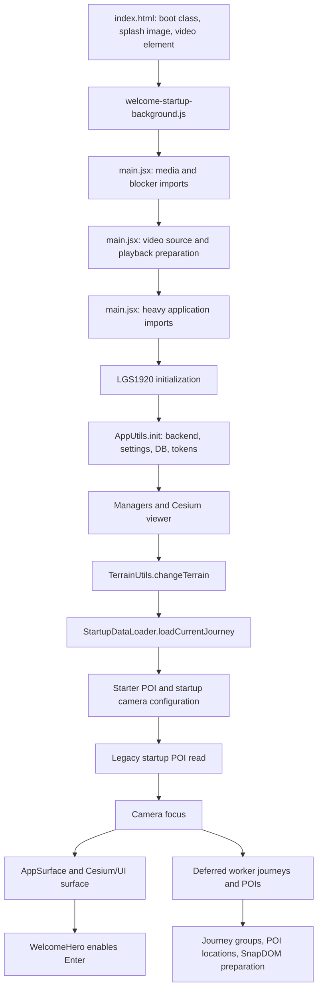

# Startup Audit: Intro to Track Display

**Date:** 2026-09-20
**Status:** Audit completed; P0/P1 corrective pass implemented; browser validation pending
**Scope:** Static intro, bootstrap, application initialization, Cesium viewer, terrain, current journey, current POIs, camera focus, and first track rendering.

This audit describes the current worktree implementation. It does not treat the progressive startup worker as production-ready until the browser validation and broader data-fidelity tests are complete.

## Executive assessment

| Stage | Status | Assessment |
| --- | --- | --- |
| Static splash image | **OK** | The HTML shell and `welcome-startup-background.js` can display a fallback image before React is mounted. |
| Intro video setup | **PARTIAL** | `main.jsx` prepares the video before importing the heavy application modules, but a real browser measurement is still missing. |
| Intro visibility | **PARTIAL** | The boot class masks Cesium and keeps the welcome screen visible, but the current documentation still describes the splash as PWA-only. |
| Enter button guard | **OK in isolation** | `WelcomeHero` refuses entry until `initComplete` and `appReady` are both true. |
| Application initialization | **TOO BLOCKING** | Configuration, backend, managers, terrain, current journey, starter POI, and camera preparation are chained before entry becomes possible. |
| Worker current journey loading | **FIXED in code** | Requests now use the `type: 'request'` envelope with an explicit `requestType`; a regression test covers this contract. |
| Current POIs | **IMPROVED** | The current journey POIs are loaded once before readiness; the deferred path skips that duplicate scan. |
| Camera focus | **PARTIAL** | Focus has a callback and a 2.5 second fallback, but readiness is not tied to a verified rendered current track. |
| Current track rendering | **UNVERIFIED through worker** | The legacy path calls `prepareDrawing()` and then `Journey.draw()`. The worker path reconstructs data and creates equivalent data sources manually, but has no dedicated regression test. |
| Secondary journeys | **IMPROVED** | Journey and track data are streamed and registered, while Cesium geometry stays deferred until the journey or track is explicitly selected. |
| Terrain and 3D layers | **PARTIAL** | Terrain is awaited on the critical path. Base 3D, 3D Tiles, and imagery start from the surface and are not included in a precise readiness contract. |
| Observability | **PARTIAL** | Startup marks now cover the shell, media, React, sync, terrain, current track, POIs, camera, surface, and Enter. Browser traces and duration measures remain to be collected. |

The urgent worker protocol mismatch is fixed in the current worktree. The primary journey and its current POIs now complete before readiness is reported, and worker failures fall back to the legacy database readers. Browser validation with a real multi-journey local database remains required.

## Priority review

The worker now provides a progressive first display: `StartupDataLoader.loadJourney()` prioritizes the persisted current track and keeps later track geometry out of the initial Cesium path. The remaining track packets can still be reconstructed without forcing `Journey.draw()` to render every track before the interface is usable.

The startup chain also contains three independent delays before the entry button can be enabled:

1. `AppUtils.init()` performs configuration, server discovery, backend ping, settings, layer, widget, replay, country, and build fetches in sequence.
2. `LGS1920Context.initManagers()` awaits `DatabaseSyncManager.bootstrap()`. When a persistent folder is linked, bootstrap can enumerate and import every JSON file before the viewer is created.
3. `initializeData()` awaits terrain, the complete current journey reconstruction, all current journey POI packets, and the widget cache before continuing to camera setup.

The no-journey path has its own unnecessary dependency. `setupStarterPOI()` can call `ensurePOILocation()`, which invokes the geocoder before the intro can be released. An empty workspace should be able to reach the ready state without a network geocoding request.

The implementation priority is therefore:

1. **P0 — Measure the actual boot gates.** Add marks around configuration, sync bootstrap, terrain, current journey packet completion, first current track source, first current POI batch, camera focus, surface readiness, and Enter availability. Run this against an empty database, a large current journey, several journeys with many POIs, a linked folder, slow terrain, and worker failure.
2. **P0 — Make the primary journey progressive.** Reconstruct and draw the persisted current track as soon as its packets are complete. Keep the remaining current journey tracks available as data and create their Cesium geometry when selected. Readiness is based on the first visible current track and the required initial POI batch.
3. **P0 — Remove external services from the first visible track gate.** Terrain must have a bounded fallback policy. The current track must be displayable on the available globe or ellipsoid while terrain resolves; terrain refinement can update clamping and request another render.
4. **P0 — Keep synchronization consistent without freezing the interface.** The linked-folder import must either complete before the database snapshot is selected or expose a documented snapshot policy. It must not silently clear the local data and then hold the intro indefinitely while importing a large profile.
5. **P1 — Make the empty-workspace path independent.** Do not resolve or persist the starter location before entry unless it is required for the first camera frame. Use the configured coordinates immediately and resolve descriptive location data later.
6. **P1 — Move widget cache hydration and all secondary work out of the first gate.** Widget positions, groups, secondary journeys, remaining POIs, location geocoding, and SnapDOM preparation must run cooperatively after the first visible state.
7. **P1 — Verify the worker data contract.** Test every supported track geometry and metadata variant, including smoothing inputs and source versus render content, before making the progressive worker path the only normal path.

Until the first two P0 items are complete, changing Cesium terrain or adding more workers is unlikely to solve the observed startup stall. The first browser test should prove the following sequence with a large local database: intro visible, current track visible, initial POIs visible, Enter enabled, then secondary loading continuing without a long main-thread block.

## Current execution path



The intended product behavior is narrower than this graph: the intro should be visible immediately, the current journey and its associated POIs should become ready first, and all secondary work should remain outside the blocking path.

## What currently works

### The static intro can appear before React

`index.html` contains the splash and the Cesium container independently of React. `welcome-startup-background.js` applies the selected fallback image before the React application is mounted. This is the correct foundation for avoiding a blank page while JavaScript modules are evaluated.

`main.jsx` also loads the welcome media module before importing `LGS1920`, applies the video source with `load: false`, and then starts the heavier application imports. This ordering is aligned with the requirement that the user sees the intro while Studio initializes.

The static splash and the React welcome hero now share one startup video. The splash logo is hidden once React is mounted so the hero keeps one logo and one slogan at the normal size and position. The initialization panel and numeric progression are removed; a small callout below the CTA remains until entry is available.

### Entry is protected by an explicit readiness check

`WelcomeHero` derives `readyToEnter` from `initComplete && appReady`. It disables the Enter action while that value is false and calls `onEnter` only after the guard succeeds. The existing UI tests cover the disabled state and the transition after readiness.

Cesium remains mounted and hidden behind the intro while the current journey, track, POIs, camera, and first surface render become ready. Secondary journey and POI loading starts after the user reveals Studio and does not block this visible state. After reveal, Studio displays `Gameplay is ready.` only when a current journey exists. An empty workspace stays quiet until the user imports or creates a journey.

### Cesium uses an explicit render request mode

`ensureViewer()` enables `scene.requestRenderMode`. Track drawing calls `scene.requestRender()` after the GeoJSON source has been loaded and styled. This reduces continuous rendering pressure when the scene is idle, provided that every asynchronous scene mutation continues to request a render.

### The worker protocol is designed to apply back pressure

`StartupWorkerClient` waits for the consumer before acknowledging a packet. The worker emits journey geometry and POI batches instead of posting an unbounded stream. The worker also opens IndexedDB read-only and does not perform application migrations or cache writes. These are good design decisions for large local databases.

### Secondary Cesium layers are not awaited by the initial React state

`MapLayer`, `Base3DLayer`, and `Tiles3DLayer` start their provider or tileset work from React effects. Their asynchronous readiness is not used as the main `appReady` condition. Secondary track geometry is also kept out of the initial Cesium render path, although provider and terrain work can still compete with the first display.

## Problems and risks

### P0 — The worker request could not be dispatched — fixed

`StartupWorkerClient.request()` posts the request object and preserves its `type`. `StartupDataLoader` uses `type: 'journey'`, `type: 'journey-keys'`, and `type: 'pois'`. However, `startupData.worker.js` begins with a guard equivalent to:

```js
if (message?.type !== 'request') {
    return
}
```

The worker therefore ignored all three application requests. The client now removes the operation-specific `type` from the payload and sends it as `requestType` inside a `type: 'request'` envelope. `startup-worker-client.test.js` locks this protocol down.

Before the fix, this made the following state transition unsafe:

```text
loadCurrentJourney() -> no hydrated journey -> currentJourneyReady = true
```

This explains why the UI can appear initialized while the current journey or its tracks are absent.

### P0 — Readiness could be reported without a usable current journey — fixed in code

`initializeData()` now waits for the first usable current track and the first current POI batch, then verifies that the resolved journey is installed as `lgs.theJourney` and that the application store is ready before setting `currentJourneyReady`. The worker prioritizes the persisted current track, draws it as soon as its packets are complete, and reconstructs later tracks without creating their Cesium geometry during startup.

The remaining limitation is that there is no browser-level assertion that the first rendered Cesium frame contains the current track. The following checks still belong in the next regression test:

- a current journey was found;
- the journey was registered in `lgs.journeys`;
- a current track was selected;
- every current track has a corresponding `GeoJsonDataSource`;
- the source contains loaded entities;
- the first render was requested;
- the associated current POI batch has been installed.

`appReady` also includes `appSurfaceReady`, but `AppSurface` reports readiness after animation frames or a `postRender` callback. That callback says that the surface rendered; it does not prove that the current route entities are visible.

### P0 — The primary worker failure had no safe fallback — fixed in code

The worker is used to load the primary journey during initialization. `StartupDataLoader` now catches worker creation and request failures, disposes the failed client, and falls back to the known `TrackUtils.readCurrentFromDB()` path. The same boundary exists for remaining journeys and POIs.

For the primary journey, the worker should be an optimization boundary. It must not become the only path that can display an existing local journey.

### P0 — Terrain blocked the primary journey — fixed in code

`initializeData()` now starts `TerrainUtils.changeTerrain()` without awaiting it. `TerrainUtils.setTerrain()` can wait for an external Cesium terrain provider or an Ion resource, so a slow provider no longer delays current track loading and Enter availability.

The available globe or ellipsoid is used while terrain resolves. A successful terrain assignment updates the scene and requests subsequent Cesium rendering; a failed deferred request is logged and leaves the fallback terrain active.

### P0 — Current POI ownership was duplicated — fixed in code

The worker now emits the current POIs immediately after the prioritized track. `StartupDataLoader` installs batches as they arrive and releases the first readiness gate after the first batch. `runDeferredJourneyDataLoad()` receives `currentPOIsReady: true` and waits for the active primary request before loading the remaining data. The legacy POI read remains the fallback when the worker is unavailable.

The primary POI path now has one worker owner and one completion signal. Remaining POI batches continue through the active worker request.

### P0 — Persistent-folder synchronization remains a consistency gate

`DatabaseSyncManager.bootstrap()` remains awaited before the local database is read when a linked profile may replace the local snapshot. This keeps the imported profile and the in-memory current journey consistent. The intro remains visible during this asynchronous work, and dedicated startup marks now expose its duration. Moving this import behind readiness would require a reload or a live reconciliation protocol before it is safe.

### P1 — Main-thread work remains heavy after the worker — fixed in code

The worker moves IndexedDB reads, decoding, filtering, and packetization away from the main thread. Cesium mutations remain on the main thread, so the startup loader now limits them to the first current track. For later journeys and later tracks, it creates the data model and empty datasources only; `Utils.updateJourneyEditor()` and track selection trigger the draw for the selected item.

The deferred promise is not awaited by the React render, but work inside that promise can still produce long main-thread tasks and visible interaction stalls. The startup path now waits for an idle window before each secondary journey, between secondary POI batches, before group initialization, between location resolutions, and before SnapDOM preparation. The first current track keeps its fast path; all later tracks stay outside that render path until explicit selection. When a selected large track is rendered, compatible styles can use Cesium `GeoJsonPrimitive` buffer collections, while dash or underlay styling keeps the entity fallback.

### P1 — The worker path reconstructs only a reduced track feature — fixed in code

`startupData.js` removes the geometry from the original `content`, but now keeps the complete feature metadata and sends non-line geometry as a complete geometry packet. `StartupDataLoader` restores the metadata, properties, feature identifiers, bounding box, and source geometry before Cesium rendering.

The contract still streams line and multi-line coordinates in batches. The source track remains separate from the prepared render content, so coordinate-related arrays remain available to replay and statistics.

### P1 — Smoothing ownership is not proved — covered by tests

The render smoothing tests prove that smoothing creates cached render content without mutating the stored source coordinates. The startup worker contract test now also covers feature metadata and non-line geometry; browser validation remains required for a large local database.

### P2 — Startup lifecycle does not dispose the worker — fixed in code

`LGS1920` disposes the `StartupDataLoader` when the component unmounts, which terminates the worker and rejects its pending request.

### P2 — The intro contract and PWA documentation disagree

The current HTML/CSS work makes the boot splash visible whenever `body` has `lgs-app-booting`. The platform documentation still says that the boot splash belongs to the installed PWA only. The product decision must be made explicit and the documentation aligned with the actual behavior.

### P2 — There is no complete startup measurement

The current code logs that Studio is loaded, but it does not expose a reliable timeline for:

- first static intro paint;
- video source assignment and first playback;
- React bootstrap completion;
- backend/configuration completion;
- viewer creation;
- terrain request start and completion;
- first current journey packet;
- first current track source loaded;
- current POI batch installed;
- camera focus callback;
- surface readiness;
- Enter enabled;
- Studio revealed;
- secondary loading completion.

Without these marks, a local database with several journeys cannot be compared with a small database, and Cesium terrain or 3D Tiles cannot be separated from application work.

## Audit of the first track display

The legacy path is:

1. Read the persisted current journey key.
2. Deserialize the journey and tracks.
3. Register the journey in the application context.
4. Select the persisted current track or the first track.
5. Call `journey.prepareDrawing()`, which creates one GeoJSON data source per track and one custom data source for the journey.
6. Call `journey.draw({action: DRAWING_FROM_DB, mode: FOCUS_ON_FEATURE})`.
7. Each track calls `TrackUtils.draw()`, which loads the track content into its GeoJSON data source with `clampToGround: true`, applies the track style, updates visibility, and requests a Cesium render.
8. Configure the camera and start the focus operation.

This path is conceptually coherent and should remain the reference behavior for the fallback implementation.

The worker path now performs the primary sequence incrementally, but its current status is not yet browser-verified:

- worker dispatch now uses the explicit request envelope; a focused client test covers the message type;
- the loader creates data sources manually instead of using the shared `prepareDrawing()` contract;
- the loader verifies the current journey/store readiness before the application readiness flag is set and prioritizes the first track, but still lacks a first-render assertion;
- the loader reconstructs a reduced feature object;
- no browser test proves that a real local database reaches visible current track entities.

## Recommended action plan

### Phase 0 — Restore a safe primary path

1. **Fix and specify the worker protocol — implemented.** Requests now use `{type: 'request', requestType: 'journey'}` and the client regression test covers the envelope. Tests for `journey-keys`, `pois`, `ack`, worker error, and disposal remain useful follow-up coverage.
2. **Add a primary fallback — implemented.** Worker creation and request failures fall back to the known main-thread readers for the current journey, remaining journeys, and POIs.
3. **Make readiness truthful — implemented in code.** The prioritized current track, first current POI batch, journey/store state, and camera preparation now precede `currentJourneyReady`. A browser assertion for current track entities and the first render is still required.
4. **Validate the single primary POI owner — implemented in code.** The worker loader installs the current POIs in batches before the first readiness signal, and the deferred path waits for the active primary request before loading the remainder. Keep this contract covered by an end-to-end startup test.

### Phase 1 — Measure the critical path

5. **Add startup marks — implemented in code.** Marks now cover the shell, media, React mount, app initialization, manager and sync initialization, terrain, current journey, track, POI, camera, surface, reveal, and Enter. Add duration measures and database-size summaries during browser validation.
6. Capture a startup trace on representative cases: empty database, one small journey, one large journey, several journeys with many POIs, slow terrain, unavailable terrain, and worker failure.
7. Record the first long task after the intro appears and after Enter becomes available. Separate React evaluation, IndexedDB, Cesium source loading, terrain, imagery, 3D Tiles, and POI location work.

### Phase 2 — Define the critical path explicitly

8. Keep the static intro independent from React and heavy module evaluation.
9. Move only the minimum required work before current journey readiness: application context, database access, current journey, current track sources, associated POIs, and camera target preparation.
10. Treat terrain, imagery, base 3D, 3D Tiles, groups, secondary journeys, all remaining POI locations, and SnapDOM preparation as background work unless a product requirement proves they are needed for the first track frame — implemented for terrain, widget cache, and SnapDOM; browser validation remains.
11. Keep the documented bounded terrain policy: display on the available globe or ellipsoid while terrain resolves, then apply the resolved terrain asynchronously.

### Phase 3 — Make background work cooperative

12. Schedule secondary journey work one journey or one track at a time, with an explicit yield after each Cesium source load and style update.
13. Process all POIs in bounded batches and schedule location resolution independently from initial POI visibility.
14. Make group initialization incremental or defer it until the first user request if it does not affect the current journey display.
15. Dispose the startup worker, pending listeners, timers, and request handlers on unmount, retry, and initialization failure.

### Phase 4 — Validate Cesium behavior

16. Verify the Cesium 1.145 behavior used by the project for `Scene.setTerrain`, `Terrain`, clamped GeoJSON entities, `requestRenderMode`, and ground clamping.
17. Confirm that base imagery, base 3D, and 3D Tiles do not change the current journey camera or visibility while they load in the background.
18. Measure data-source and entity counts for large journeys. Keep `GeoJsonDataSource` where its styling and interaction contract requires it; consider a lower-level primitive path only after profiling proves entity overhead is the bottleneck.

### Phase 5 — Add regression coverage

19. Add a unit test for the worker protocol and acknowledged packet ordering.
20. Add a unit test for journey and track reconstruction that preserves map order, geometry type, endpoints, feature properties, and source versus render content.
21. Add a unit test for primary readiness and worker fallback.
22. Add a UI test for the full Enter guard: intro visible, button disabled, current journey ready, button enabled, and reveal callback invoked once.
23. Add a browser test with a deterministic IndexedDB fixture containing multiple journeys and many POIs. Assert that the current journey appears before secondary work completes and that the UI remains responsive while secondary work continues.
24. Add failure cases for slow or unavailable terrain, worker errors, empty databases, malformed journeys, and missing current-track keys.

## Acceptance criteria

The implementation should not be considered complete until all of these are observable in a real browser:

- the intro image or video appears before the heavy Studio UI is evaluated;
- Cesium and secondary UI remain hidden during initialization;
- the current journey is selected from persisted state or the documented fallback journey;
- the current track source contains visible entities before Enter is enabled;
- the associated current POIs are available before Enter is enabled;
- pressing Enter does not wait for secondary journeys, all POI locations, groups, SnapDOM, base 3D, or 3D Tiles;
- secondary work is incremental and does not create repeated long main-thread stalls;
- a worker failure falls back safely and does not silently report a false-ready state;
- slow or unavailable terrain follows the documented bounded policy;
- the full path is covered by deterministic unit/UI tests and at least one browser test using a multi-journey local database;
- the actual measured startup marks are recorded for an empty database and a representative large database.

## Relevant implementation files

- [`index.html`](../../index.html) — static splash, boot class, Cesium container, and React mount point.
- [`welcome-startup-background.js`](../../src/assets/media/welcome-startup-background.js) — pre-React fallback image setup.
- [`main.jsx`](../../src/main.jsx) — media preparation and deferred application imports.
- [`LGS1920.jsx`](../../src/components/LGS1920.jsx) — initialization sequence, readiness state, camera focus, and deferred loading trigger.
- [`AppSurface.jsx`](../../src/components/AppSurface.jsx) — Cesium/UI surface and surface readiness signal.
- [`StartupDataLoader.js`](../../src/core/ui/startup/StartupDataLoader.js) — current and deferred journey/POI hydration.
- [`StartupWorkerClient.js`](../../src/core/ui/startup/StartupWorkerClient.js) — acknowledged worker protocol on the main thread.
- [`startupData.worker.js`](../../src/core/ui/startup/startupData.worker.js) — IndexedDB reads and worker dispatch.
- [`startupData.js`](../../src/core/ui/startup/startupData.js) — journey, geometry, and POI packetization.
- [`TerrainUtils.js`](../../src/Utils/cesium/TerrainUtils.js) — terrain provider resolution and terrain assignment.
- [`Viewer.jsx`](../../src/components/cesium/Viewer.jsx) — Cesium viewer configuration and render mode.
- [`TrackUtils.js`](../../src/Utils/cesium/TrackUtils.js) — data-source preparation and track rendering.
- [`Journey.js`](../../src/core/Journey.js) and [`Track.js`](../../src/core/Track.js) — journey and track draw contracts.
- [`POIManager.js`](../../src/core/ui/POIManager.js) — startup and complete POI reads.

## Existing validation and gaps

The existing suite covers welcome hero behavior, camera startup configuration, track render smoothing, and the legacy deferred journey loader. The audit did not find a dedicated worker startup test or a browser test that loads a real multi-journey IndexedDB fixture through the intro-to-track path.

The repository checks already run during this audit passed for the current worktree build and unit suite, but they do not validate the real worker protocol or Cesium startup timing. A successful build must therefore not be interpreted as evidence that the current journey is displayed.
